   

  # Portfolio
 Course : Applied Data Sciences KB-74  
 Project name : Cyber Security  
 Name : Jae Kyu Lee   
 Birthplace : Republic Of Korea  
 Student Number : 18132782  
 E-mail address : dlworb1994@naver.com  

### Project's Objecitive 
     -> Collecting twitter feeds and making classifier & Sentiment analysis Specified for CyberSecurity

### 1. Introduction

My name is Kyu, I'm from Republic of Korea(South Korea) and i am 24 years old.
My majors in home university(University Of Seoul) are Big-Data Analysis & Geo-Informatics.
My dream is to become an international big-data analyst who specializes in spatial data.
So i decided to take this course - Applied data science at THUAS.
I'm working on a project - Cyber Security.
I chose this project because i have wanted to analyze SNS data with Machine-learnig for a long time.

In my project me and my project mates usually use the knowledges provided by the course. For example we use python libraries Pandas and Numpy, making own fuctions etc. Because i studied python and machine-learning hard with Datacamp and Coursera, i can do my project well.
But i also use the knowledges studied by myself like library tweepy, making twitter developer ID and how to use it and sentiment analyis etc. My project is related with twitter so i have to study a lot for using and dealing with twitter to get tweet data. Also i have to study a lot with sentiment analysis with references and video clips in youtube.

Reading our Research Report will help understand how our project is going on.
### [Research Report](Research_Report.pdf)  

 

### 2. Jargon
 
Frequent & Important words which are used in Cybersecurity's Work.

 * _Anonymous_.- a decentralized international hacktivist group that is widely known for its various DDoS cyber attacks against several governments, government institutions and government agencies, corporations, and the Church of Scientology.

 * _API_.- Abbreviation for application programming interface : a way ofcommunicating with a particular computer program or internet service.
 
 * _Classifier_. - Category of Unified Modeling Language (UML) elements that have some common features, such as attributes or methods

 * _Cyberattack_.- An attempt by hackers to damage or destroy a computer network or system.
 
 * _Cybersecurity_.- The state of being protected against the criminal or unauthorized use of electronic data, or the measures taken to achieve this.
 
 * _Hacktivism_.- The activity of getting into computer systems without permission inorder to achieve political aims.
 
 * _Hacktivist_.- A person who gains unauthorized access to computer files or networks in order to further social or political ends.
 
 * _Sentiment Analysis_.- The process of computationally identifying and categorizing opinions expressed in a piece of text, especially in order to determine whether the writer's attitude towards a particular topic, product, etc. is positive, negative, or neutral.
 
 * _Social media_.- Refers to websites and computer programs that make communication possible with the use of computers or mobile phones.

 

### 3. Data Camp assignments
Here is the proof that i finished all the courses what i had to take during this semester for 
preparing ourselfs & project. Also it was for studying developing of the Python and Machine Learning tasks.

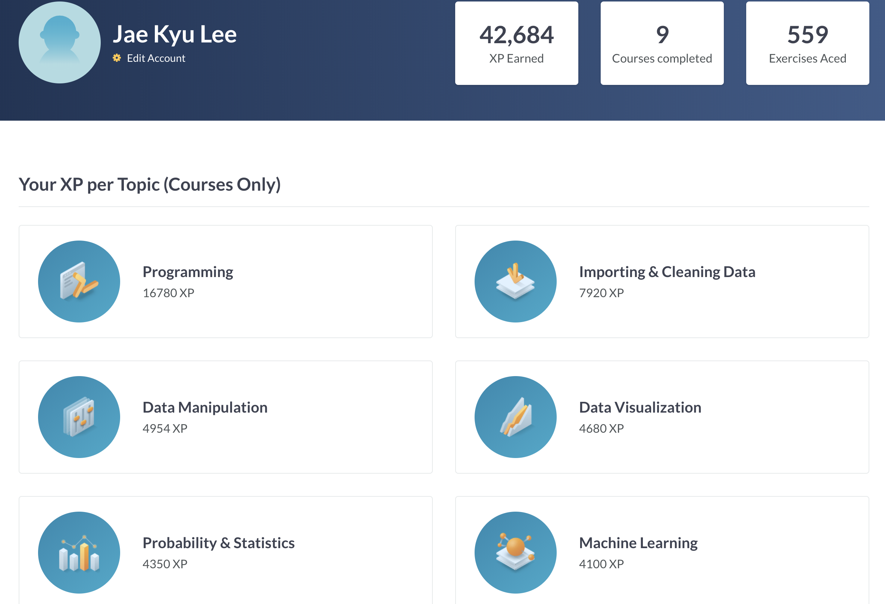

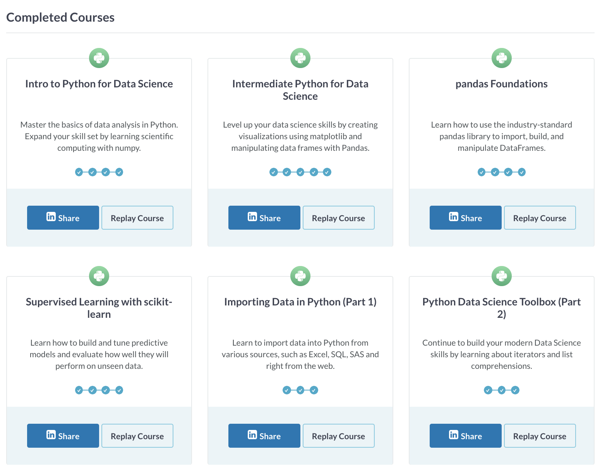

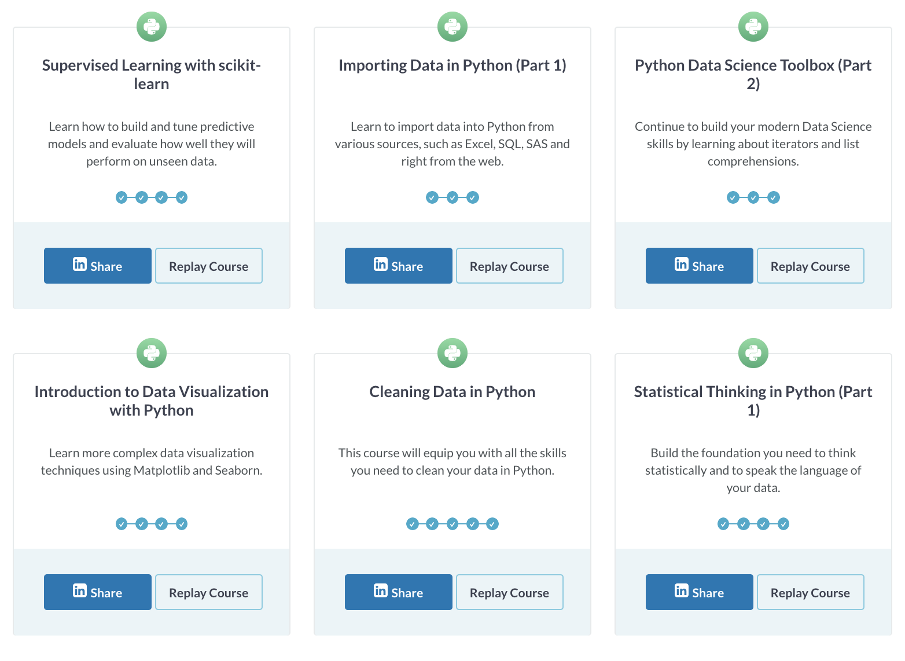
                
 

### 4. All Data Camp Courses
Here is the courses that i accomplished in Datacamp not only what i had to take but also what i studied additionally.
    
   * 1.- [Introduction to Python Course](StatementofAccomplishment(9).pdf)
 
     * 2.- [Intermediate Python for Data Science Course](StatementofAccomplishment.pdf)
     
     * 3.- [Introduction to Data Visualization With Python Course](StatementofAccomplishment(8).pdf)
     
     * 4.- [pandas Foundations Course](StatementofAccomplishment(6).pdf)
     
     * 5.- [Python Data Science Toolbox (Part 2)](StatementofAccomplishment(2).pdf)
     
     * 6.- [Importing data in Python (Part 1)](StatementofAccomplishment(7).pdf)
     
     * 7.- [Cleaning Data in Python Course](StatementofAccomplishment(3).pdf)
     
     * 8.- [Statistical Thinking in Python (Part 1)](StatementofAccomplishment(4).pdf)
     
     * 9.- [Supervised Learning with scikit-learn Course](StatementofAccomplishment(5).pdf)
     
      
     
 ### 5. Coursera
 Here is the proof that i finished Machine-Learning courses on Coursera.
 
  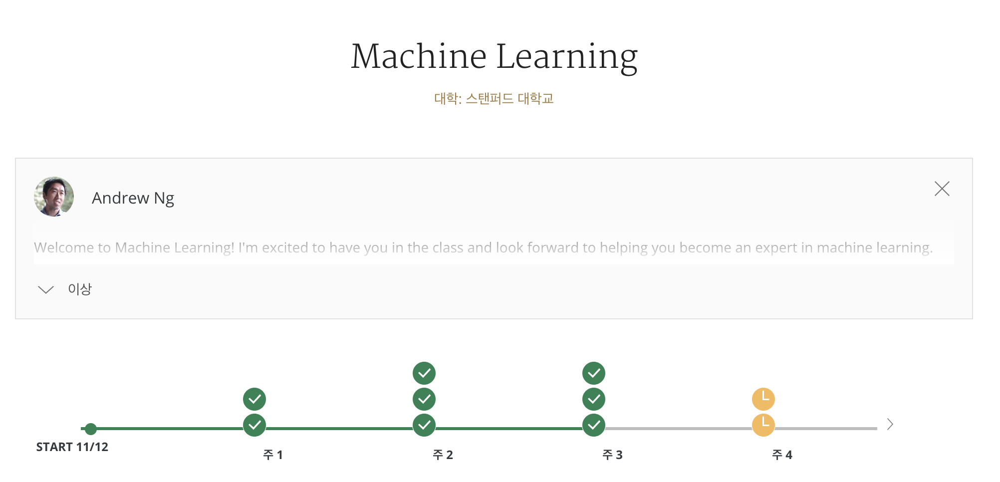
 
  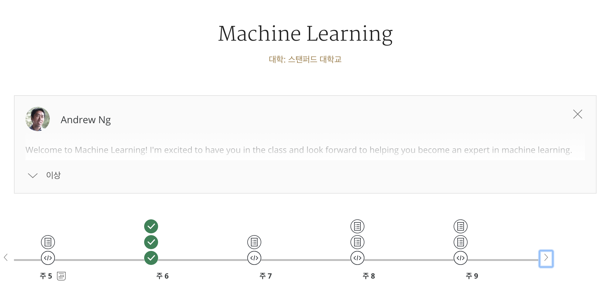
  
   
      
### 6. Presentations
    Here are presentations that i did in this semester. My group did weekly presentation with one person.
    
    
   * 1.- [My first Presentation(Week5)](cybersecurity_week5.pdf)
     
   * 2.- [My Second Presentation(Week11)](cybersecurity_week11.pdf)

 

### 7. Python Notebooks
In this part i made some my own programmes and codes for using our project. It was for counting words like hactivist's keywords in tweets, hashtags which they use and username they advert. 

   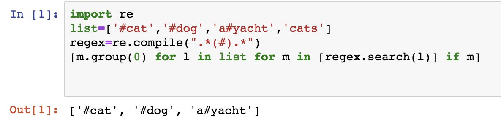 

 
First, this code which is kind of prototype inspires me to make codes for word counting. I just tried to make basic code first and then want to understand what should i make addtionally.

 
Before counting words, i have to extract pure sentences from twitter data. 
In this step, i made code for extracting tweets from twitter with using userID list(hacktivists, excel format) and my twitter developer ID for accessing twitter. I access twitter with developer ID and extract user's tweets who are written in my userID list. Also i extract number of retweets and likes, date of tweet and length of tweet.  

   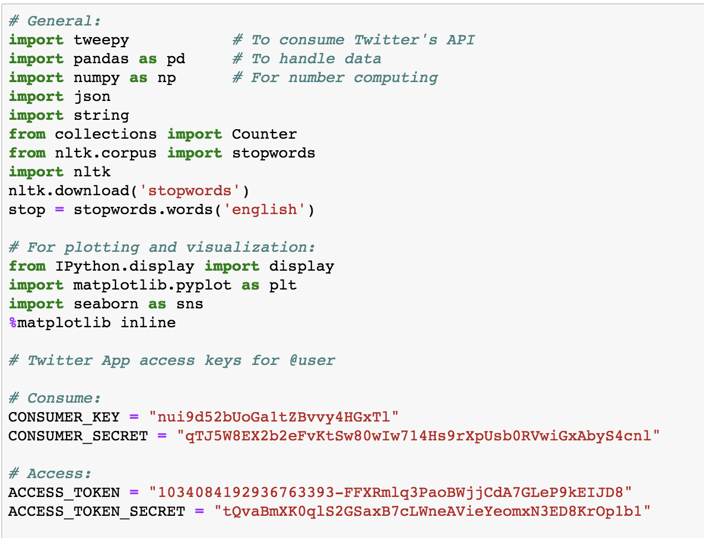
 
  
   This is the basic settings for using code.   
   
   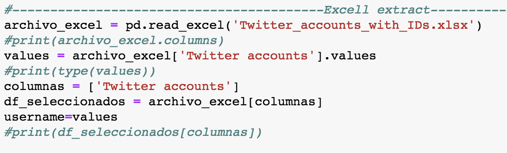  
   
    
   This is the code for extracting tweets from twitter with using userID list(hacktivists, excel format). I have 70 hactivist's tweeter ID. It was offered by our supervisor. 
    
   
   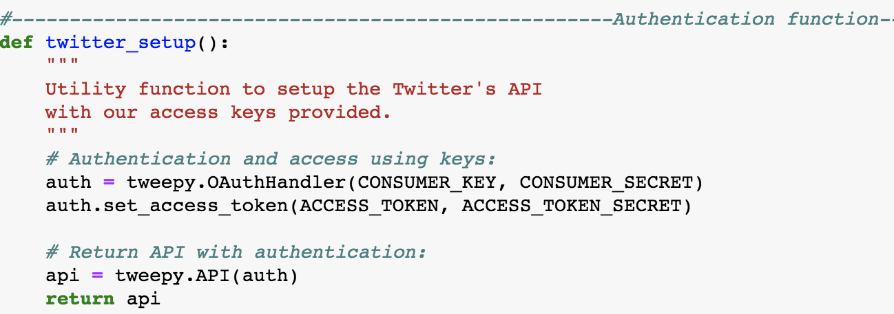 
   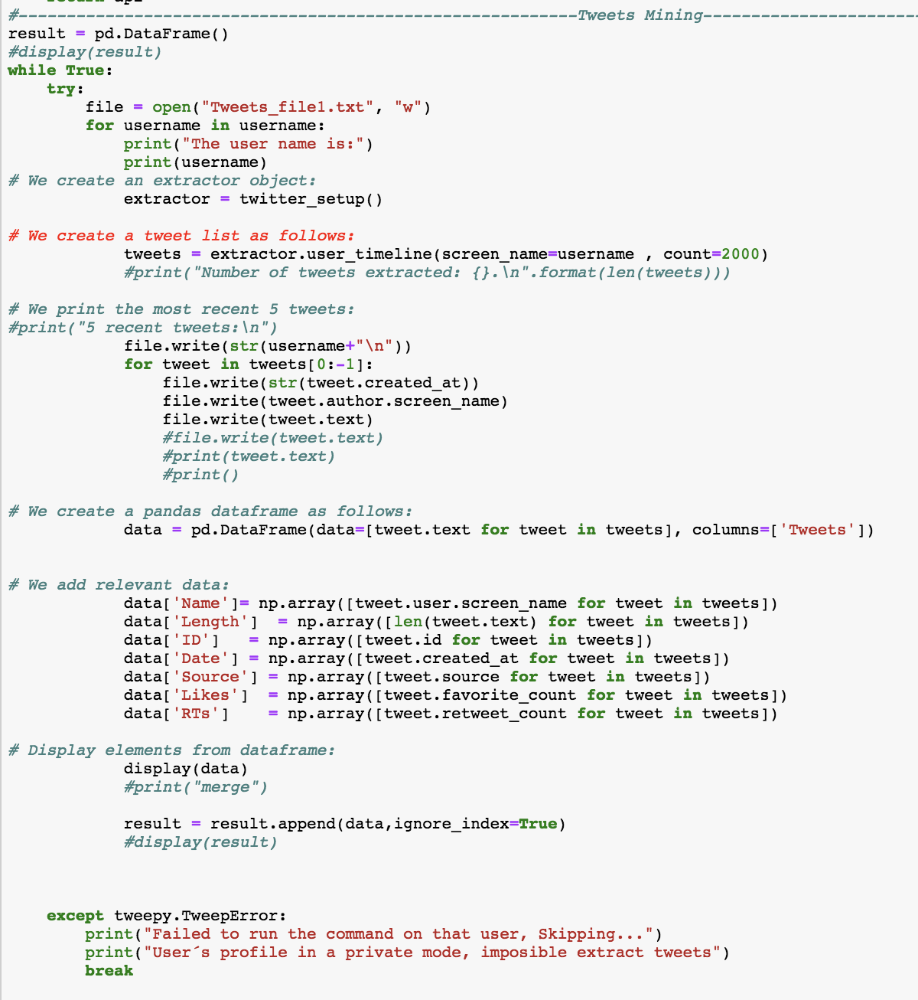 
   
    
   In this part, i made code for mining tweets from twitter. I did it with my project mate Jorge. 
   
  
   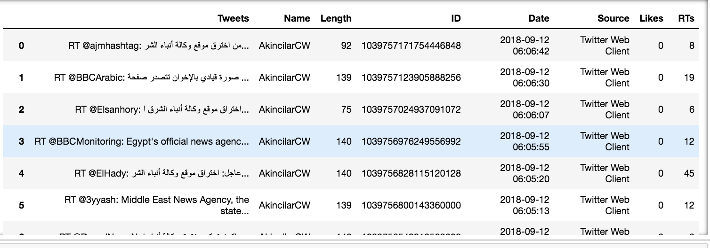 
   
 

   And it is the result of tweets. There are tweets, name of user, length of sentence, ID, date of tweet, source, number of likes and retweets.
   
 
Next step, i have to refine extracted tweets. Because if i use word counting code with not refined tweets, the result will be full with words like 'a','the','is' kind of these words that we usually use in normal sentence(not hactivst's sentence). This result will hinder our goal to extract hacktivist's word. So i made 'removig punctuation' code for refining kind of these words.  
 

   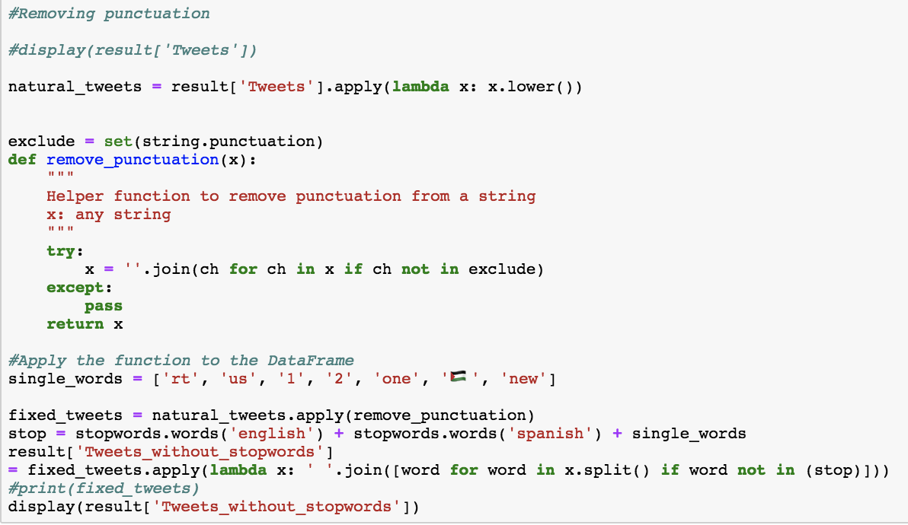 
   
    
   In this code, stopwords.words('english') means words like 'a','the','is' etc, stopwords.words('spanish') means words like 'a','the','is' etc with spanish. And single_words is a my own list of words not contained in stopwords but should be erased from extracted tweets. I just made it because i worried that i can miss some words except stopwords. After running counter code, i add some words to single_words if i notice unimportant words in the result of counter.
   
    
After using removing punctuation code, i can get tweet sentences consist of words which are excluded unimportant words for getting hacktivist's words.  
 

   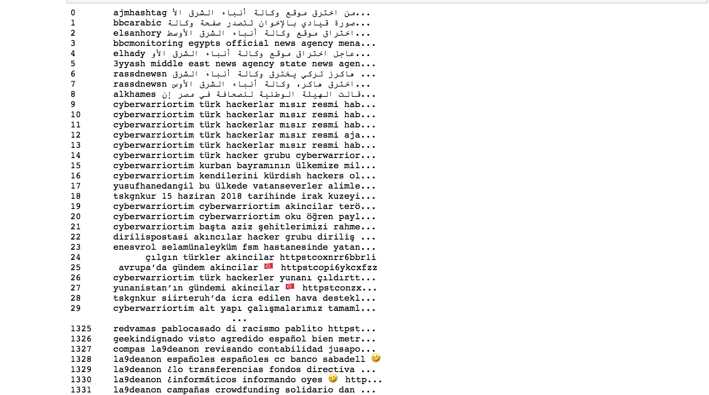
 
  
Finally i created code that creates a list of the most frequently used words with pandas series. This result is very important in my project because i use this words and numbers again until end of the project to figure out graphs, compare numbers of one word between users etc. It is no exaggeration to say that creating this code accounts for half of the project. 
   
  
   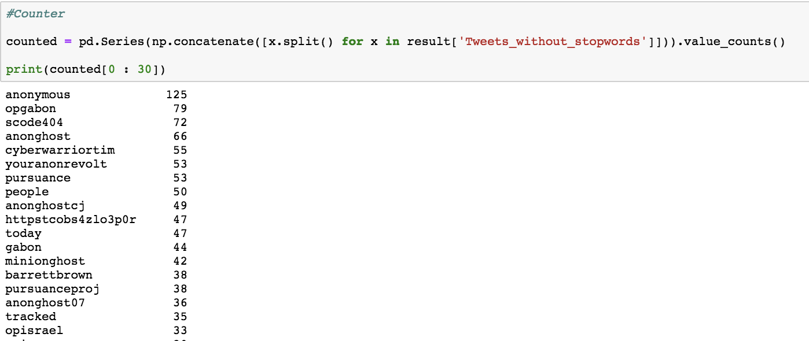 
   
    
Additionally i created code that creates a list of the most frequently used hashtags which they use and usernmae they advert. Because of using removing punctuation, i can't figure out numbers of hashtags and usernames. Because the punction elimates special characters like @,#,$,& etc. So i have to add new sentences from counter code and change some sentences. 
 

   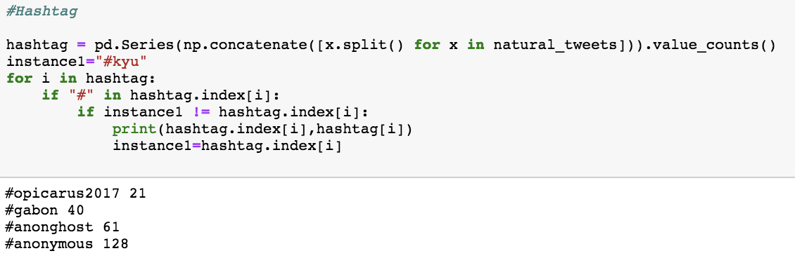 
   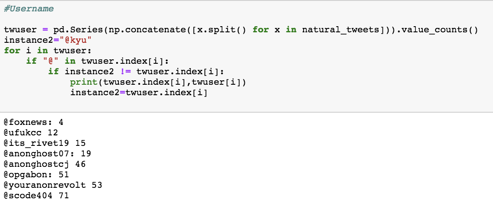  

 
   
 
### 8. Other works 
  
In my project, me and my project mates have to make classifiers for distinguish whether user is hactivist or not. First of this step, we have to make our own hand-written sentiment classifer with 16000 tweet sentences. Because we can't get precise hactivist words dictionary so we have to make our own hactivist words dictionary with standards for our project. We labeled all tweet sentences whether it is a hactivist's sentence or not. If it is a hactivist's sentence or contained keywords from our counter code, we labeled 1. If it is a normal sentence or not english sentence, we labeled 0. 
 
   
   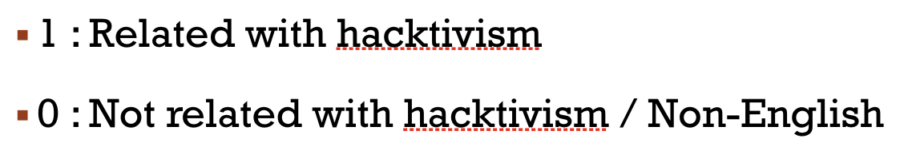 
    
   
   These are the examples that we labeled. 
    
   
   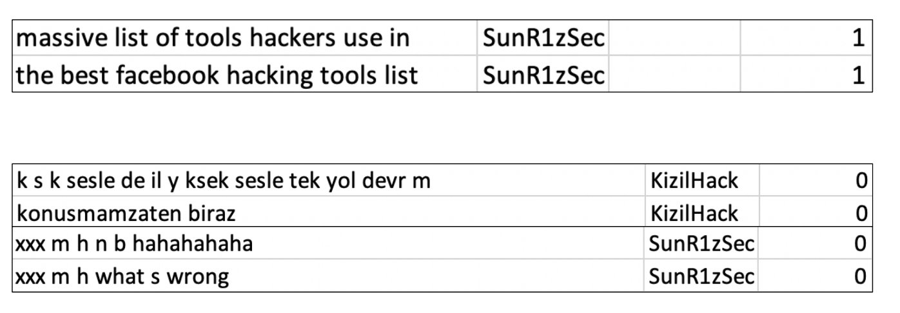 
    
   
   Because there are words like hacker, hacking contained in sentence, we labled 1. And we labeld 0 for below sentences because those are normal sentences or non english sentences. 
    
   
   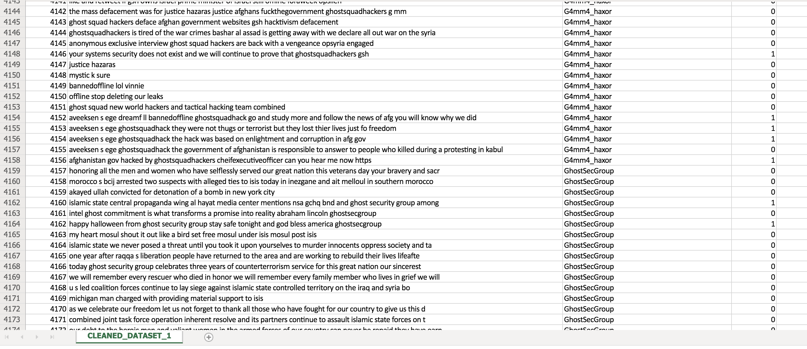 
    
   
   This is just few part of our sentiment classifier. I labeled 2000 tweets from 11 users.
   Finally we completed labeling all the tweets, and use this sentiment classifier to next step. 
     
    
   ### [Cleaned_Dataset](cleaned_dataset.pdf)   
   This is an our final sentiment classifier.
   
   
    

### 9. Partcodes before changing objective
     
Unfortunately our groups objective was changed in November because of some problems to get knoledges and supervisor's comment. So there are not much code that we used for this group. But there are many codes that we used before changing our objecitives so i just put this codes at the end of my portfolio for proving that i did hard work on my project.

  [part1](part1.png) 
  [part2](part2.png) 
  [part3](part3.png) 
  [part4](part4.png) 
  [part5](part5.png) 
  [part6](part6.png) 
         
    
   
   This code was supposed to use for sentiment analysis in tweets to analyze how much it is positive or negative, predicting hactivist will attack or do something and profiling several hactivist's personality.

 

### 10. Scrum
We use scrum tools - Microsoft Office Planner. 

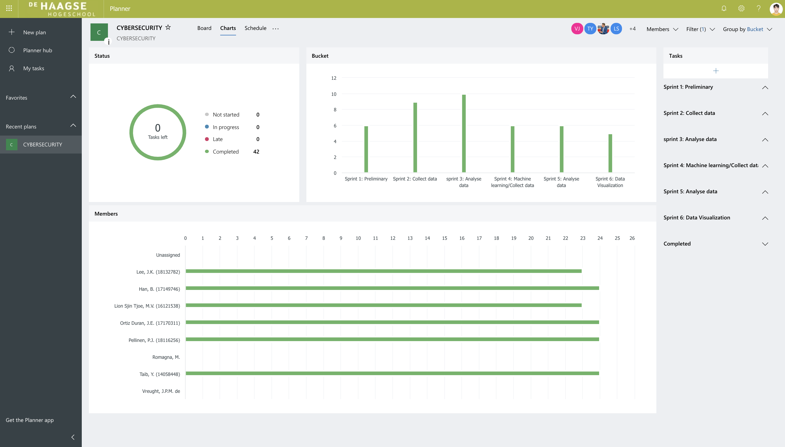
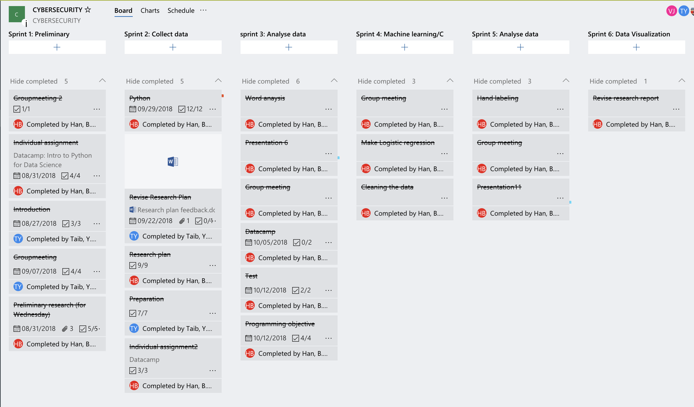
 
   
My group set 1 sprints with a length of 2 weeks. We have 6 Sprints and completed 42 tasks. In my case, i completed 23 tasks.

   * 1.- [Sprint 1 : Preliminary](sprint1.png)
        * Group meeting
        * Individual assignment
        * Introduction
        * Group meeting
        * Primary Research - Brain Storming
       
   * 2.- [Sprint 2 : Collect data](sprint2.png)
        * Python - make sentiment anlaysis code
        * Revise research plan 
        * Preparation for starting computer work
        * Group meeting
        * Individual assignment - Datacamp
    
   * 3.- [Sprint 3 : Analyse data](sprint3.png) 
        * Word analysis - make word count function
        * Presentation 5
        * Group meeting
        * Test code
        * Programming objective 
        * Datacamp
    
   * 4.- [Sprint 4 : Machine-learning/Collect data](sprint4.png) 
        * Group meeting
        * Make Logistic Regression
        * Cleaning the data
    
   * 5.- [Sprint 5 : Analyse data](sprint5.png) 
        * Group meeting
        * Hand labeling
        * Presentation 11
    
   * 6.- [Sprint 6 : Data visualization](sprint6.png) 
        * Revise research report
        * Group meeting

 
   
### 11. References

    * 1.- Eung Yong Park. (2011). Jump to Python, Easypublishing
    
    * 2.- Wes Mckinny. (2013). Python for data analysis. O'Reilly
    
    * 3.- Harrington, P. (2012). Machine learning in action. Shelter Island: Manning.
    
    * 4.- tthustla. (2018). Another Twitter Sentiment Analysis with Python - Part 1. 26/10/2018, de GitHub Sitio web: https://github.com/tthustla/twitter_sentiment_analysis_part1/blob/master/Capstone_part2.ipynb
    
    * 5.- Alec Go, Richa Bhayani y Lei Huang (2009). Twitter Sentiment Classification using Distant Supervision,*academia.edu.9*,1-6.
    
    * 6.- Cambridge University Press. (2018). Cambridge Dictionary. 09/11/2018, de Cambridge University Press Sitio web: https://dictionary.cambridge.org/dictionary/english/
    

                
